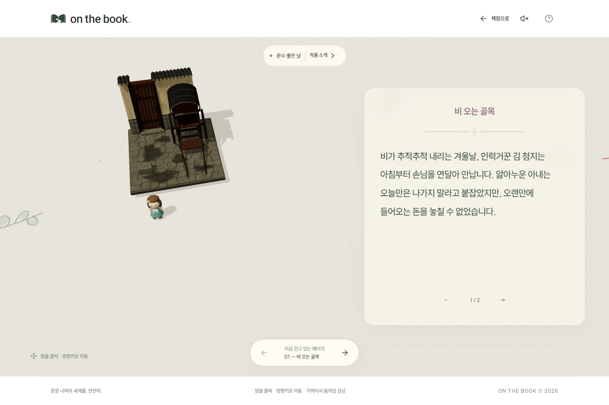
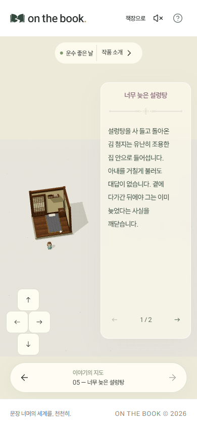

# 운수 좋은 날 3D 월드 수정 기록

‘운수 좋은 날’ 다섯 장면의 모델 크기와 위치를 정돈하고, 실제 모델보다 지나치게 넓었던 통행 제한·반응 범위를 줄였다. ‘이상한 나라의 앨리스’와 ‘오즈의 마법사’의 공간 구성과 바닥 안내 방식을 참고했다.

## 저장 상태와 PR 범위

- 2026년 10월 1일 14:51(한국 시간), 공용 DB의 관리자 초안에 저장했다. 저장 버전은 16에서 17로 바뀌었다.
- 저장 직후 다시 읽어 수정 내용이 일치하는지 확인했다. 그 시점의 공개본, 다른 두 작품, 모델 보관함, 홈 설정은 유지됐다.
- 이 PR은 이미 수행한 DB 편집의 변경 내역과 확인 화면을 보관한다. 앱 코드나 DB 구조 변경은 포함하지 않는다. PR 병합이 데이터를 다시 저장하거나 공개하지는 않는다.
- [changes.json](changes.json)은 변경 전후 값과 저장 당시의 검증 결과를 담은 검토·복구 참고 자료다. 자동 실행되는 데이터 변경 파일은 아니다.

## 달라진 점

- 다섯 모델의 크기를 정돈하고 앞 네 장면의 위치를 조정했다. 기존 전용 모델, 회전, 본문, 장면 순서는 유지했다.
- 모델의 실제 외곽 크기를 기준으로 통행 제한 범위를 조정했다. 장면별 반응 범위가 서로 겹치지 않도록 했다.
- 넓은 반응 범위 때문에 가려지던 기존 안내 화살표가 장면마다 8개씩 표시된다.
- 각 장면에 나뭇잎·펼친 책·찻잔 중 두 개의 바닥 장식을 배치했다. 기존 보관함의 이미지를 사용했다.

아래 반경은 화면 픽셀이 아닌 3D 공간의 거리다. 통행 제한에는 모델 크기가 반영되고, 반응 범위에는 장면의 접근 배율이 반영된다. 정확한 설정값은 JSON에 보관했다.

| 장면 | 통행 제한 반경 | 반응 반경 | 안내 화살표 |
| --- | --- | --- | --- |
| 비 오는 골목 | 18.060 → 4.522 | 37.820 → 10.744 | 0 → 8 |
| 남대문 정거장 | 18.040 → 4.932 | 37.780 → 11.564 | 0 → 8 |
| 이어지는 벌이 | 18.900 → 5.005 | 39.500 → 11.710 | 0 → 8 |
| 선술집 | 18.060 → 4.824 | 37.820 → 11.348 | 0 → 8 |
| 너무 늦은 설렁탕 | 17.600 → 4.726 | 36.900 → 11.152 | 0 → 8 |

## 확인한 내용

Microsoft Edge의 자동화 브라우저에서 배포용 빌드를 사용해 확인했다. PC 화면은 1440×960, 모바일 화면은 390×844로 검사했으며 동작 줄이기 설정을 사용했다.

- 다섯 장면의 모델 로딩, 모델 가까이에서 시작하기, 본문 표시와 페이지 넘기기
- 순서대로 장면 이동, 모델에서 멀어지면 본문 숨김, 다시 접근하면 본문 표시, 걸어서 다음 장면으로 이동
- 관리자 편집 화면과 독자 체험, 모바일에서 모델·본문 표시
- 데이터 형식 검사, 반응 범위 겹침 없음, 실행 중 브라우저 오류 없음, 배포용 빌드 성공
- 기록된 변경을 저장 직전 자료에 적용하면 저장 직후의 전체 자료와 정확히 일치함

아래 화면은 저장할 수정본을 검증하면서 촬영했다. 이후 동일한 내용이 DB에 저장됐는지 별도로 확인했다. 이 기록은 저장 당시 상태를 설명하며 이후의 공개 여부는 관리자에서 확인할 수 있다.

## 확인 화면

### PC

### 모바일

